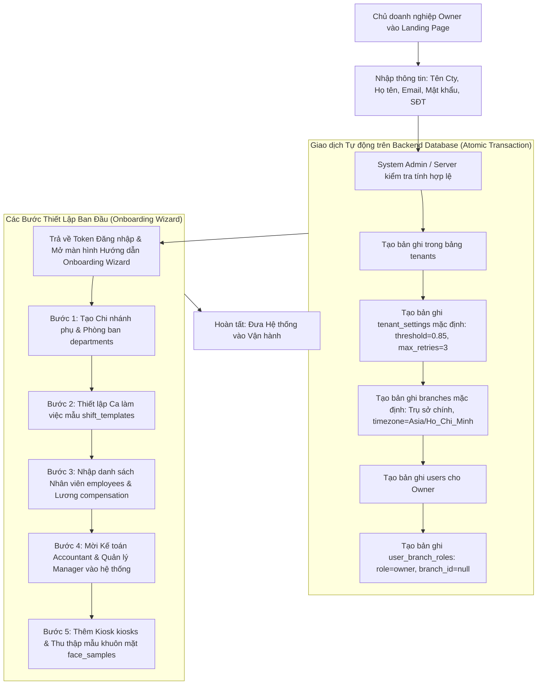
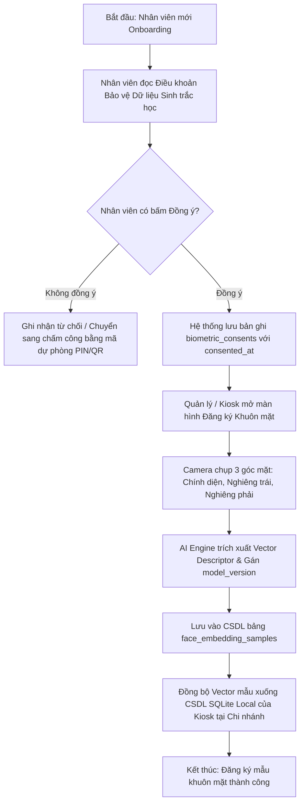
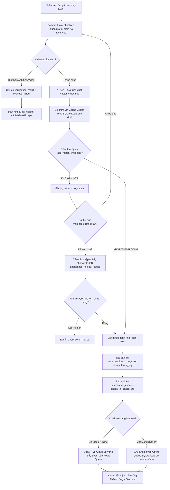
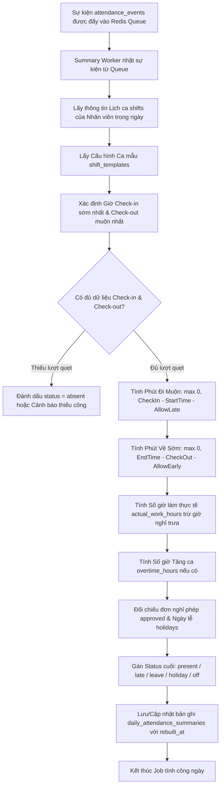
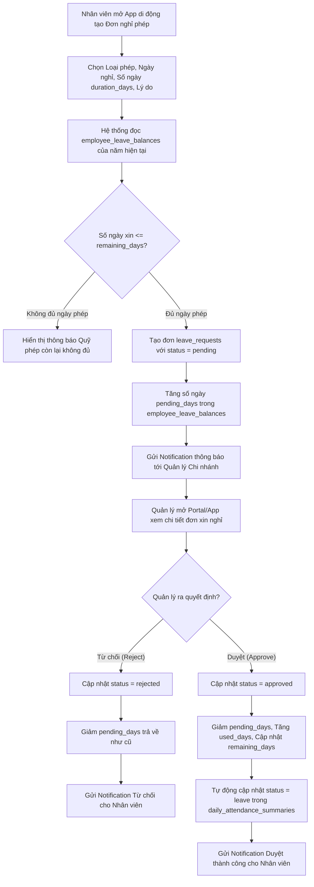
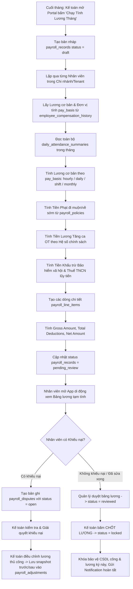
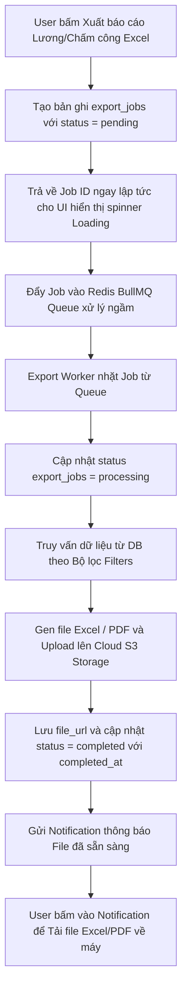

# TÀI LIỆU SƠ ĐỒ LUỒNG NGHIỆP VỤ (FLOWCHARTS)

---

## **1. Giới thiệu**
Tài liệu này tổng hợp toàn bộ các **Sơ đồ Luồng Nghiệp vụ (Flowcharts)** vẽ bằng định dạng **Mermaid** cho 7 phân hệ cốt lõi của hệ thống Quản lý Nhân sự, Chấm công Sinh trắc học & Tính lương Multi-Tenant. 

Tài liệu giúp lập trình viên Frontend, Backend, App Di Động, Kiosk và Kiểm thử viên (QA) dễ dàng hình dung và hiện thực hóa logic ứng dụng.

---

## **2. Danh sách 7 Sơ đồ Luồng Nghiệp vụ Chính**

### **2.1. Flowchart 1: Luồng Đăng ký Doanh nghiệp mới & Thiết lập Ban đầu (Tenant Onboarding)**

---

### **2.2. Flowchart 2: Luồng Thu thập Cam kết Đồng ý & Đăng ký Mẫu Khuôn mặt AI**

---

### **2.3. Flowchart 3: Luồng Chấm công Thời gian thực tại Kiosk (Check-in Realtime & Offline)**

---

### **2.4. Flowchart 4: Luồng Động cơ Tính công Ngày Tự động (Daily Summary Engine)**

---

### **2.5. Flowchart 5: Luồng Xin & Duyệt Nghỉ Phép (Leave Request Workflow)**

---

### **2.6. Flowchart 6: Luồng Tính Lương Cuối Kỳ, Sửa Lương, Khiếu Nại & Chốt Lương (Payroll Workflow)**

---

### **2.7. Flowchart 7: Luồng Kết xuất Báo cáo File Bất đồng bộ (Async Export Job)**

---
*Tài liệu Sơ đồ Luồng Nghiệp vụ (Flowcharts) này được lưu trực tiếp tại thư mục d:\UTT\ để phục vụ phát triển ứng dụng.*
