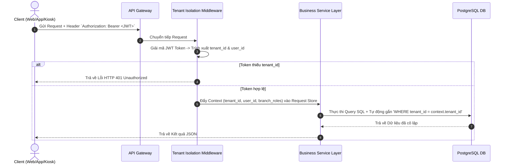
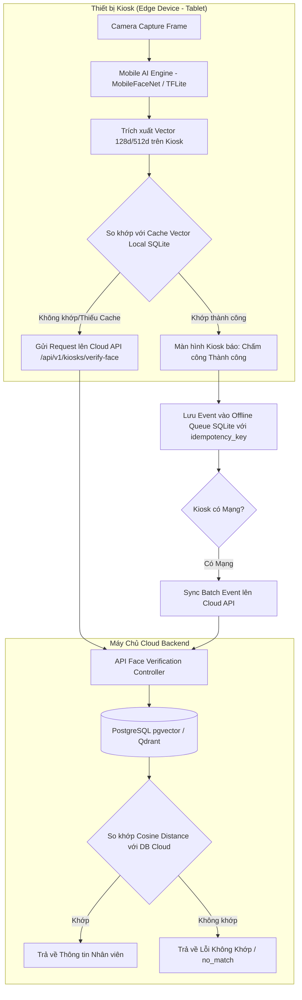
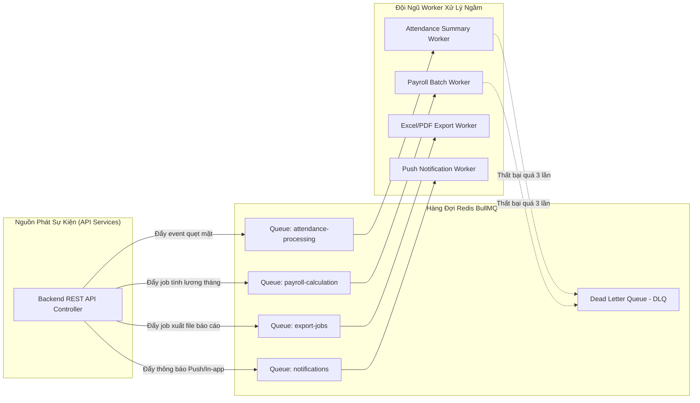
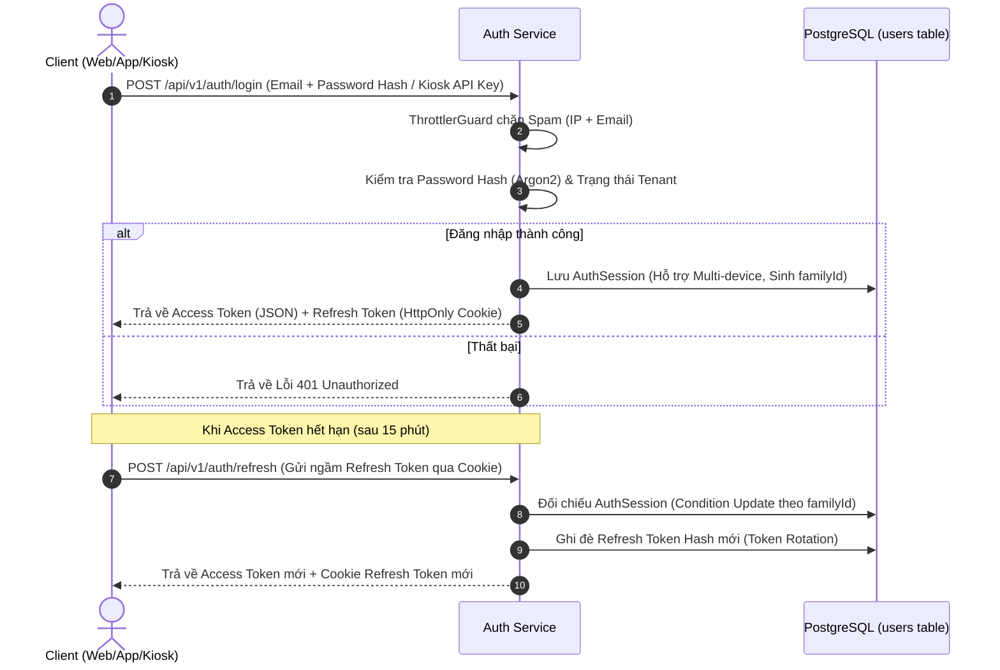
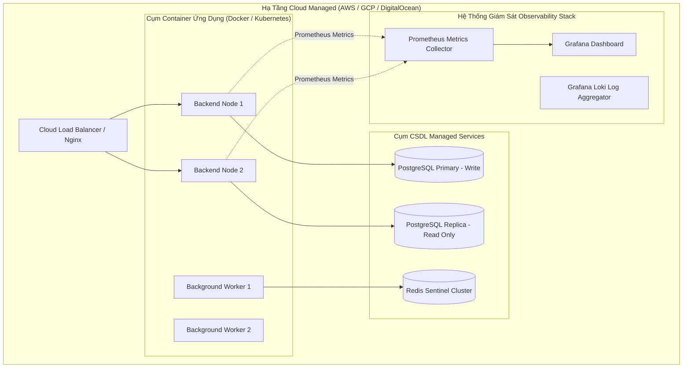

# TÀI LIỆU THIẾT KẾ KIẾN TRÚC HỆ THỐNG
#(SYSTEM ARCHITECTURE DOCUMENT – SAD)

---

## **1. Giới thiệu & Mục tiêu Kiến trúc (Introduction & Architectural Goals)**

### **1.1. Mục đích tài liệu**
Tài liệu Thiết kế Kiến trúc Hệ thống (SAD) đặc tả cấu trúc hạ tầng kỹ thuật, mô hình các phân lớp (Layered Architecture), chiến lược đa khách thuê (Multi-Tenancy Isolation), mô hình nhận diện khuôn mặt Hybrid (Edge/Cloud), và cơ chế xử lý bất đồng bộ (Async Queue) cho hệ thống **Quản lý Nhân sự, Chấm công Sinh trắc học & Tính lương Multi-Tenant**.

Tài liệu là kim chỉ nam cho đội ngũ **Solution Architect, Backend Lead, DevOps, Security và Frontend/App/Kiosk Lead** để triển khai dự án chuẩn xác.

### **1.2. Các Mục tiêu Chất lượng Kiến trúc (Quality Attribute Goals)**

| Chỉ số chất lượng | Mục tiêu đặt ra | Giải pháp Kiến trúc tương ứng |
| :--- | :--- | :--- |
| **Strict Multi-Tenancy** | Cô lập dữ liệu 100% giữa các Tenant | Shared DB + Row Level Security / Middleware Tenant Interceptor |
| **Low Latency Check-in** | API Kiosk quẹt mặt phản hồi `< 200ms` | Edge AI trên Kiosk + Local SQLite Cache Vector |
| **High Availability** | SLA khả dụng tối thiểu `99.9%` | Microservices Ready + Load Balancer + DB Master/Replica |
| **Async Processing** | Không nghẽn luồng HTTP khi tính lương | Redis BullMQ Message Queue + Event Workers |
| **Biometric Privacy** | Tuân thủ GDPR & Nghị định 13/NĐ-CP | Mã hóa Vector At-Rest + Xóa dữ liệu vật lý theo yêu cầu |

---

## **2. Kiến trúc Tổng quan Hệ thống (High-Level Architecture)**

Hệ thống tuân theo mô hình **Tách biệt Đa tầng (Layered Architecture)** kết hợp với **Event-Driven Microservices-Ready**.

```mermaid
graph TD
    subgraph Layer1["1. Tầng Trình Diễn (Presentation Layer / Clients)"]
        Web[Web Portal Admin/Manager/Accountant<br/>React.js / Next.js]
        Mobile[Mobile App Staff<br/>Flutter / React Native]
        Kiosk[Kiosk Tablet Client<br/>Android / iOS Native App]
    end

    subgraph Layer2["2. Tầng Gateway & Bảo Mật (Gateway & Security Layer)"]
        NGINX[API Gateway / Nginx Reverse Proxy]
        WAF[Web Application Firewall & Rate Limiter]
    end

    subgraph Layer3["3. Tầng Ứng Dụng Backend (Application Layer)"]
        AuthSvc[Auth & IAM Service]
        OrgSvc[Tenant & Org Service]
        EmpSvc[Employee & Bio Service]
        AttSvc[Attendance Core Service]
        LeaveSvc[Leave Management Service]
        PaySvc[Payroll Engine Service]
    end

    subgraph Layer4["4. Tầng Xử Lý Bất Đồng Bộ (Async Queue Layer)"]
        RedisQueue[Redis BullMQ Queue]
        AttWorker[Attendance Summary Worker]
        PayWorker[Payroll Batch Worker]
        ExportWorker[Report Export Worker]
        NotifWorker[Notification Worker]
    end

    subgraph Layer5["5. Tầng Lưu Trữ (Storage Layer)"]
        MainDB[(PostgreSQL Primary DB<br/>Extension pgvector)]
        ReplicaDB[(PostgreSQL Read Replica)]
        RedisCache[(Redis Cluster<br/>Rate Limit, Caching)]
        S3Storage[Object Storage / AWS S3<br/>File Export, Avatars]
    end

    Layer1 --> Layer2
    Layer2 --> Layer3
    Layer3 --> Layer4
    Layer3 --> Layer5
    Layer4 --> Layer5
    AttSvc --> RedisQueue
    PaySvc --> RedisQueue
```

---

## **3. Chiến lược Đa Khách Thêu (Multi-Tenancy Architecture)**

Hệ thống áp dụng mô hình **Shared Database, Shared Schema với cột phân biệt `tenant_id`** kết hợp với **Middleware Interceptor** ở tầng Backend.

### **3.1. Sơ đồ Luồng Cô lập Dữ liệu Request**

### **3.2. Quy tắc Cô lập Dữ liệu**
1.  **100% các bảng nghiệp vụ** (`employees`, `branches`, `shifts`, `attendance_events`, `payroll_records`...) đều bắt buộc chứa cột `tenant_id uuid`.
2.  **ORM Middleware (Prisma/TypeORM/Drizzle):** Tự động inject điều kiện `WHERE tenant_id = current_tenant_id` vào mọi câu lệnh `find`, `update`, `delete`.
3.  **Tách biệt Redis Cache Key:** Format key luôn có prefix: `tenant:{tenant_id}:{module}:{id}`.

---

## **4. Kiến trúc Nhận diện Khuôn mặt Hybrid (Edge + Cloud)**

Để đảm bảo Kiosk chấm công siêu tốc dưới `< 200ms` kể cả khi mạng bị chập chờn hoặc đứt kết nối, hệ thống triển khai mô hình **Hybrid Edge AI / Cloud Matching**.

---

## **5. Cơ chế Xử lý Bất đồng bộ (Async Queue Architecture)**

Hệ thống sử dụng **Redis BullMQ** làm hàng đợi tin nhắn để giải tỏa áp lực xử lý cho máy chủ HTTP REST API.

---

## **6. Kiến trúc Bảo mật & Phân quyền (Security & IAM Architecture)**

### **6.1. Quy trình Xác thực OAuth2 / JWT Token với Refresh Token Rotation**

### **6.2. Ma trận Phân quyền RBAC (Role-Based Access Control)**

| Vai trò (Role) | Cấp Quản lý | Phạm vi Chi nhánh | Quyền hạn Chính |
| :--- | :--- | :--- | :--- |
| **System Admin** | Nền tảng SaaS | All Tenants | Khởi tạo Tenant, mở/khóa Tenant, quản lý hạ tầng. |
| **Owner** | Chủ Doanh nghiệp | All Branches (`branch_id null`) | Toàn quyền tối cao trên Tenant, chốt bảng lương. |
| **Branch Manager** | Quản lý Chi nhánh | Specific Branch (`branch_id = X`) | Xếp ca, duyệt phép, sửa công tay, quản lý Kiosk tại chi nhánh. |
| **Accountant** | Kế toán | Tenant / Specific Branch | Khai báo chính sách lương, chạy bảng lương, chốt lương. |
| **Staff** | Nhân viên | Self (`employee_id = Y`) | Xem ca cá nhân, chấm công mobile/Kiosk, nộp đơn phép, xem phiếu lương. |

### **6.3. Kiến trúc Bảo vệ Đầu cuối (Secure By Default & Context Isolation)**

Hệ thống Core được thiết kế theo tư duy Zero-Trust và Enterprise Security:

1. **Global Guards (Bảo mật mặc định):**
   - `JwtAuthGuard` và `RolesGuard` được đẩy lên làm Global Guard (`APP_GUARD`) trong `app.module.ts`.
   - **Mọi endpoint API sinh ra mặc định sẽ bị khóa.** Lập trình viên muốn mở API nào (như Login/Register) phải chủ động gắn cờ `@Public()`. Cách tiếp cận này loại bỏ hoàn toàn rủi ro "quên gắn Guard làm lộ API mật".
   - Phân quyền xuyên chi nhánh được xử lý mượt mà bằng `@Roles()` và `@BranchParam()`.

2. **Chống Brute-force Nâng cao (`AuthCredentialThrottlerGuard`):**
   - Không giống Rate Limit thông thường khóa mù quáng toàn bộ IP (làm ảnh hưởng oan nhân viên khác chung mạng Wi-Fi), hệ thống khóa dựa trên tổ hợp `IP + Email Hash`. Kẻ tấn công dò mật khẩu của Giám đốc sẽ bị khóa, nhưng nhân viên khác vẫn đăng nhập bình thường.

3. **Tenant Context Isolation (`TenantInterceptor` + `AsyncLocalStorage`):**
   - Dữ liệu `tenant_id` từ JWT sau khi đi qua Guard sẽ được `TenantInterceptor` chộp lấy và ném vào một Context toàn cục (sử dụng Node.js `async_hooks`).
   - Mọi Service bên trong (ví dụ `EmployeeService`, `PayrollService`) có thể gọi `TenantContext.getTenantId()` ở bất cứ đâu trong lõi code. Cách tiếp cận này giải phóng các Controller khỏi việc phải lấy tham số từ Request rồi truyền tay xuống từng hàm Service một cách mệt mỏi và dễ sai sót.

---

## **7. Hạ tầng & Giám sát (DevOps & Monitoring Topology)**

---
*Tài liệu SAD này được lưu trực tiếp tại thư mục dự án để làm chuẩn kỹ thuật cho toàn bộ đội ngũ lập trình.*
